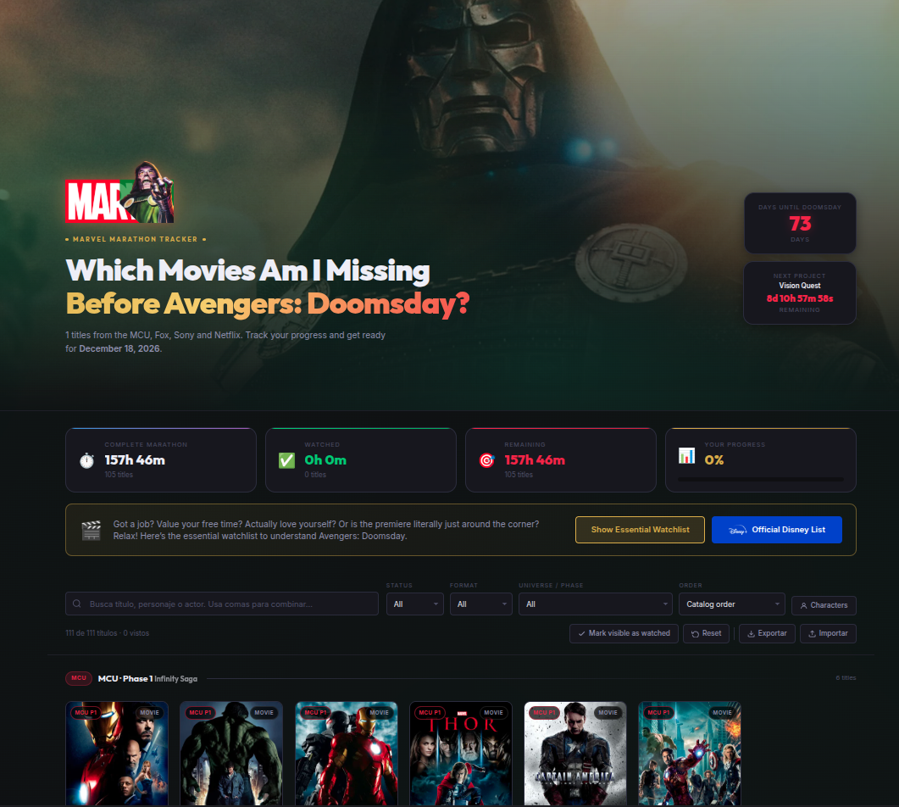

<div align="center">
  
  <br>
  <h1>Which Movies Am I Missing Before Avengers: Doomsday?</h1>

  <p><strong>An interactive Marvel marathon tracker designed to help you prepare for the next big MCU event.</strong></p>

  <p>
    🔗 <strong>Live Demo:</strong>
    <a href="https://davidferreiro-dev.github.io/Doomsday-Watchlist/" target="_blank" rel="noopener noreferrer">
      https://davidferreiro-dev.github.io/Doomsday-Watchlist/
    </a>
  </p>
</div>

---

## 🍿 About the Project

**Which Movies Am I Missing Before Avengers: Doomsday?** is a clean, interactive web application created to help Marvel fans organize, track, and complete their marathon leading up to the release of *Avengers: Doomsday* (December 2026).

Navigating decades of superhero releases across different studios can be overwhelming. This project provides a structured **112-title catalog** encompassing the Marvel Cinematic Universe, 20th Century Fox's X-Men, Sony's Spider-Verse, Netflix's Defenders saga, and legacy releases.

<p align="center">
  
</p>

---

## ✨ Features

* **112-Title Master Catalog**: Complete coverage across MCU Phases 1–6, Fox, Sony, Netflix, and legacy Marvel films.
* **Progress & Runtime Math**: Live tracking of watched vs. remaining titles, total time remaining, and completion percentage.
* **Essential Watchlist Shortcut**: Toggle a curated list of essential titles required to follow the main storylines leading to *Avengers: Doomsday*.
* **Disney Official Style Mode**: Quickly filter by official recommended watch orders.
* **Advanced Filtering & Search**: Instant filtering by Universe, Phase, Format (Movie / TV Show), and Status (Watched / Pending).
* **Data Import & Export**: Save progress automatically in `localStorage`, or export/import `.json` files to sync across devices.
* **Dynamic TMDB Enrichment**: Automatically fetches official posters, runtimes, and metadata via The Movie Database API.
* **Zero Build / Zero Dependencies**: Pure HTML, CSS, and Vanilla JS for instant performance.

---

## 📚 Catalog Scope

The catalog covers **112 titles** across all major Marvel film and television branches:

* **Marvel Cinematic Universe (MCU)**: Infinity Saga & Multiverse Saga (Phases 1 to 6).
* **Netflix / Defenders Saga**: *Daredevil*, *The Punisher*, *Jessica Jones*, *Luke Cage*, *Iron Fist*, *The Defenders*.
* **20th Century Fox**: *X-Men*, *Wolverine*, *Deadpool*, and *Fantastic Four* franchises.
* **Sony Pictures**: *Spider-Man* (Raimi & Webb), animated *Spider-Verse*, and Sony's Spider-Man Universe (SSU).
* **Legacy Productions**: *Blade* trilogy, *Ghost Rider*, and related classic properties.

---

## 🛠️ Tech Stack

* **Frontend**: HTML5, CSS3, Vanilla JavaScript (ES6+)
* **Data Source**: Local JSON dataset (`peliculas.json`) + [TMDB API](https://www.themoviedb.org/)
* **State & Storage**: Web Browser `localStorage` & JSON Import/Export

---

## 📁 Project Structure

```text
Doomsday-Watchlist/
├── Assets/          # Image assets, logos, and previews
├── index.html       # Primary HTML layout
├── styles.css       # Visual styles and responsive design
├── script.js        # Core logic, filtering, progress calculation, and API fetch
├── peliculas.json   # Catalog dataset containing all 112 titles
└── LICENSE          # MIT License terms
```

---

## 💻 Installation & Local Setup

Since this is a static project, no build tools, compilation, or `npm install` commands are required.

### Step 1: Clone the Repository

```bash
git clone https://github.com/DavidFerreiro-dev/Doomsday-Watchlist.git
cd Doomsday-Watchlist
```

### Step 2: Launch in Browser

#### Option A: Direct File Open

Open `index.html` directly in your favorite web browser.

> **Note:** Some browsers restrict local file fetching for JSON files.

#### Option B: Local Web Server (Recommended)

To prevent potential CORS restriction issues when fetching `peliculas.json`, run a lightweight HTTP server in the project root.

**Using Python 3:**

```bash
python3 -m http.server 8000
```

Then open http://localhost:8000 in your browser.

**Using Node.js (`http-server`):**

```bash
npx http-server .
```

---

## 🖼️ Detailed Credits & Legal Disclaimer

### 👨‍💻 Project Author

* **Created and maintained by:** [David Ferreiro](https://github.com/DavidFerreiro-dev)
* **Purpose:** An open-source, non-profit, fan-made organizational tool created strictly for personal tracking and educational purposes out of love for the Marvel universes.

### 🦸‍♂️ Intellectual Property & Trademarks

This project is **not** affiliated with, endorsed, sponsored, or specifically approved by any of the following rights holders. All characters, names, logos, artwork, titles, and related media are registered trademarks and copyrights of their respective owners:

* **Marvel Studios & The Walt Disney Company:** Creators and owners of the Marvel Cinematic Universe (MCU), including *The Avengers*, *Iron Man*, *Captain America*, *Thor*, and all Marvel-branded Disney+ television properties.
* **20th Century Studios (formerly 20th Century Fox):** Original producers and rights holders for the *X-Men*, *Wolverine*, *Deadpool*, and *Fantastic Four* film franchises prior to the Disney acquisition.
* **Sony Pictures Entertainment:** Owners of the film rights and distributors for *Spider-Man* (including the Tobey Maguire and Andrew Garfield films), the animated *Spider-Verse* franchise, and Sony's Spider-Man Universe (SSU) titles such as *Venom* and *Morbius*.
* **New Line Cinema (Warner Bros. Discovery):** Original production studio and distributors of the *Blade* trilogy.
* **Netflix:** Original distributors of the Marvel Defenders television saga.

### 🎬 Data & Metadata Provider (TMDB)

All movie and television metadata displayed in this application—including official promotional posters, release dates, and runtimes—is retrieved dynamically using the **[The Movie Database (TMDB) API](https://www.themoviedb.org/)**.

* This product uses the TMDB API but is not endorsed or certified by TMDB.
* TMDB is a community-built movie and TV database. We highly encourage supporting their platform if you enjoy the enriched data provided in this tracker.

### ⚖️ Fair Use Disclaimer

This application is strictly for personal, non-commercial use. The use of low-resolution poster images and promotional titles within this application qualifies as fair use under United States copyright law for the purposes of commentary, identification, and information tracking.

---

## 📄 License

This project is released under the **[MIT License](LICENSE)**.

You are free to use, copy, modify, merge, publish, and distribute this codebase, provided that the original copyright notice and permission notice are included in all copies or substantial portions of the Software.

> **Note:** The MIT License applies exclusively to the code and logic written for this application. It does not grant any rights or licenses to the third-party intellectual property, trademarks, or TMDB data mentioned above.
