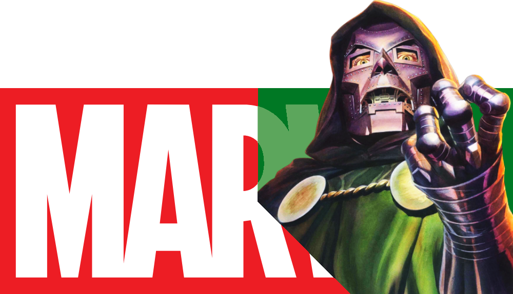

  

  # Which Movies Am I Missing Before Avengers: Doomsday?

  

    <strong>A fan-made Marvel marathon tracker to help you prepare for the biggest MCU event of the next era.</strong>
  

## 🎬 About the project

This website is a personal, fan-made watchlist and progress tracker created to help Marvel fans organize everything they need to watch before the release of *Avengers: Doomsday* in December 2026.

The catalog includes a broad set of titles from the Marvel Cinematic Universe, 20th Century Fox properties, Sony's Spider-Verse and related universe, and Netflix/Defenders-era entries. The app is built to make the marathon easier to plan, track, and complete.

It is designed for people who want to:

- know exactly which movies and shows are part of the essential Marvel timeline,
- track what they have already watched,
- estimate how much time is left before they are fully prepared,
- filter the list by status, format, universe, or phase,
- keep a clean and practical watchlist without needing any backend or database.

## ✨ Features

- 88-title Marvel catalog spanning the main storylines and connected universes
- Countdown to *Avengers: Doomsday* release date
- Total runtime and watched/remaining time tracking
- Progress bar and percentage completion
- Search by title
- Filters by:
  - watched / pending
  - movie / TV show
  - universe / phase
- Essential watchlist shortcut for the most important titles
- Disney official-style essential list toggle
- Mark visible items as watched
- Reset progress button
- Export watch progress to JSON
- Import watch progress from JSON
- Local browser persistence with `localStorage`
- Responsive and modern UI
- Dynamic TMDB-powered title enrichment for posters, runtime, and metadata

## 📚 Included universes and catalog scope

The tracker covers content from multiple Marvel-related branches, including:

- MCU timeline (Infinity Saga and Multiverse Saga)
- MCU Phase 1 through Phase 6
- Netflix / Defenders era
- 20th Century Fox titles such as X-Men and Fantastic Four
- New Line Cinema entries such as Blade
- Sony Spider-Verse and Sony's Spider-Man Universe
- Ghost Rider-related content

## 🚀 How to use it

1. Open `index.html` in your browser.
2. Browse the catalog or use the search and filters.
3. Click titles to mark them as watched or pending.
4. Use the essential watchlist to focus only on the most important titles.
5. Export your progress whenever you want to save it.
6. Import it back later to continue where you left off.

You can also host the project on any static hosting service, such as GitHub Pages or Vercel, without needing a build pipeline.

## 🛠️ Tech stack

- HTML5
- CSS3
- Vanilla JavaScript
- The Movie Database (TMDB) API
- Local browser storage for personal progress tracking

## 📁 Project structure

- `index.html` — main app structure
- `styles.css` — visual design and responsive layout
- `script.js` — catalog logic, filters, progress tracking, and TMDB integration
- `peliculas.json` — catalog data
- `Assets/` — images, icons, and visual assets
- `LICENSE` — project license

## 🧾 Data and references

This project uses data and metadata from [The Movie Database (TMDB)](https://www.themoviedb.org/). It is a fan-made, non-profit app created for entertainment and planning purposes.

The project is not affiliated with, endorsed by, or sponsored by Marvel Studios, Disney, Fox, Sony, or TMDB.

## ⚖️ License

This project is distributed under the [MIT License](LICENSE).

---

<footer>
  

    <strong>Doomsday Watchlist</strong> 
    Updated: October 2026 
    Made by David Ferreiro
  

  

    GitHub Repository: <a href="https://github.com/DavidFerreiro-dev/Doomsday-Watchlist" target="_blank" rel="noopener noreferrer">https://github.com/DavidFerreiro-dev/Doomsday-Watchlist</a>
  

  

    © 2026 David Ferreiro · Built for Marvel fans preparing for Avengers: Doomsday
  

</footer>
